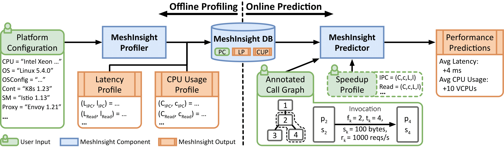

# MeshInsight

# Overview
MeshInsight is a tool to systematically characterize the overhead of service meshes and to help developers quantify overhead in deployment scenarios of interest. Read the [paper](https://arxiv.org/abs/2207.00592) for how MeshInsight works!

Note: MeshInsight currently only works on Istio. We plan to extend it to other service meshes (e.g., Cilium or Linkerd) in the future.

# Installation
## Requirements
- Python (Version >= 3.7)
- Kubernetes (Idealy version >=1.24)
  - Run `. ./utils/k8s_setup.sh` to install Kubernetes. (Note - this script is only tested on Ubuntu.)

Run the following script to install necessary tools for MeshInsight:
```bash
. ./install.sh
```
For details see [INSTALL.md](INSTALL.md).

# Run MeshInsight
||
|:--:| 
| *MeshInsight Workflow* |

MeshInsight has an offline profiling phase and an online prediction phase. The offline phase generates performance
profiles of individual service mesh components, and the online phase predicts overhead based on these profiles, service
mesh configuration, and application workload.

## Step 1: Run offline profiler
```bash
# Run profiler for latency and cpu overhead profile.
# Once it completes, the profile will be saved to meshinsight/profiles/
sudo python3 ./meshinsight/profiler/offline_profiler.py -d 30 --latency --cpu

usage: offline_profiler.py [-h] [-v] [-c] [-l] [-d DURATION] 

optional arguments:
  -h, --help            show this help message and exit
  -v, --verbose
  -c, --cpu             run offline latency profiling
  -l, --latency         run offline cpu profiling
  -d DURATION, --duration DURATION
                        default duration is 15s                    
```
Note: The profiler will delete all kubernetes deployments before it starts to minimize interference.

## Step 2: Run online predictor
```bash
# Run prediction based on an example call graph
python3 ./meshinsight/predictor/online_predictor.py -c ./meshinsight/predictor/config/example1.yml -p meshinsight/profiles/profile.pkl 

usage: online_predictor.py [-h] [-v] [-p PROFILE] -c CONFIG

optional arguments:
  -h, --help            show this help message and exit
  -v, --verbose
  -p PROFILE, --profile PROFILE
                        path to the profile
  -c CONFIG, --config CONFIG
                        path to config file
```

Please see `PREDICTION.md` for reference of configuration files.

# Repo Structure
```
Repo Root
|---- benchmark   
|---- meshinsight   # MeshInsight source code
  |---- profiler    # Source code for offline profiler
    |---- benchmark   # Benchmarks used in the paper and their wrk scripts
  |---- predictor   # Source code for online predictor
|---- utils         # Some other tools for analyzing service mesh deployments
|---- samples       # Demo of service mesh performance analysis
```

# Reference
Please consider citing our paper if you find MeshInsight related to your research.
```bibtex
@misc{https://doi.org/10.48550/arxiv.2207.00592,
  url = {https://arxiv.org/abs/2207.00592}, 
  author = {Zhu, Xiangfeng and She, Guozhen and Xue, Bowen and Zhang, Yu and Zhang, Yongsu and Zou, Xuan Kelvin and Duan, Xiongchun and He, Peng and Krishnamurthy, Arvind and Lentz, Matthew and Zhuo, Danyang and Mahajan, Ratul},
  title = {Dissecting Service Mesh Overheads},
  publisher = {arXiv},
  year = {2022}
}
```

# Contact
If you have any questions or comments, please get in touch with Xiangfeng Zhu (xfzhu@cs.washington.edu).
